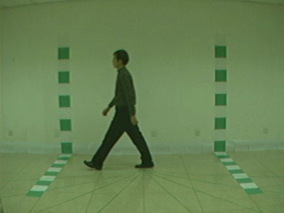
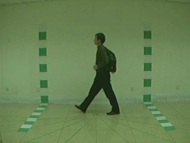
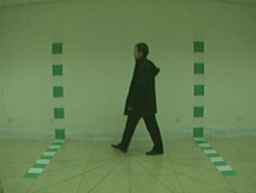

<h4>MMH-Gait: A Multi Model Hybrid Approach for Gait Recognition Using VGG16, ResNet50, ViT, GoogLeNet (Inception-v1) and EfficientNet-B0 with Fusion Methods</h4>


<div 
align="center">


</div>
<div align="center">
  <strong>NM</strong>&nbsp;&nbsp;&nbsp;&nbsp;&nbsp;&nbsp;&nbsp;&nbsp;&nbsp;&nbsp;&nbsp;&nbsp;&nbsp;&nbsp;&nbsp;&nbsp;<strong>BG</strong>&nbsp;&nbsp;&nbsp;&nbsp;&nbsp;&nbsp;&nbsp;&nbsp;&nbsp;&nbsp;&nbsp;&nbsp;&nbsp;&nbsp;&nbsp;&nbsp;<strong>CL</strong>
</div>

Gait recognition is an emerging biometric technology that identifies individuals based on their unique walking patterns. Unlike other biometric systems such as fingerprint, iris, or facial recognition, gait recognition has the distinct advantage of being unobtrusive and capable of functioning at a distance. This makes it particularly valuable in surveillance and security applications, where identifying individuals without their active cooperation is often necessary.

The fundamental premise of gait recognition lies in the fact that each person has a distinctive way of walking, influenced by a combination of anatomical and behavioral characteristics. These include factors like leg length, body shape, posture, and the rhythm of movement. By capturing and analyzing these gait patterns, a gait recognition system can accurately distinguish between different individuals.

Traditional approaches to gait recognition have relied heavily on handcrafted features and classical machine learning techniques. However, recent advancements in deep learning have revolutionized the field, enabling the automatic extraction of complex and discriminative features from raw gait data. Convolutional Neural Networks (CNNs) and Vision Transformers (ViTs) have shown particular promise in this regard, offering robust performance in various gait recognition tasks.

### Table of Contents
- [Project Overview](#project-overview)
- [Project Requirements](#project-requirements)
- [Installation](#installation)
- [Dataset](#dataset)
- [Architecture](#architecture)
- [Training](#training)
- [Testing](#testing)
- [Results](#results)
- [Use Cases](#use-cases)

### Project Overview
In this project, we leverage the strengths of three state-of-the-art (SOTA) classification models: **VGG16**, **ResNet50**, **Vision Transformer (ViT)**, **GoogLeNet (Inception v1)** and **EfficientNet-B0**. These models have demonstrated superior capability in capturing intricate patterns in visual data. To further enhance recognition accuracy, we fine-tuned these models and employed a combination of fusion techniques:
#### Feature-Level Fusion:
This involves combining the feature representations extracted from each model to create a richer and more comprehensive feature set. In FLF, we extract features using different models, then aggregate these features using pointwise addition to classify them. [See the  [Main architecture](#main-diagram1) for better unserstanding].

#### Decision-Level Fusion: 
Here, the outputs of individual models are combined, typically using methods like majority voting or weighted averaging, to make the final decision. In DLF, we first classify each method and then use a majority voting mechanism to determine the final class. [See the [Main architecture](#main-diagram1) for better unserstanding].

#### Hybrid Fusion:
A sophisticated approach that integrates both feature-level and decision-level fusion, aiming to harness the benefits of both techniques for improved performance. In Hybrid Fusion, we utilize ResNet50 and Vision Transformer (ViT) for FLF, along with GoogLeNet (Inception v1) and EfficientNet-B0 also for FLF. We then combine the outputs of these two FLFs with VGG16 to perform DLF. There are various combinations, but this specific one yields the highest classification result. [See the [Main architecture](#main-diagram1) for better unserstanding].

### Project Requirements
- Python 3.8+
- Pytorch 1.10+
- NumPy
- Matplotlib
- Pillow
- Opencv
- Scikit-learn
- Torchvision

### Installation
1. Clone the repository:
```bash
git clone https://github.com/kamrulhasanrony/MMH-Gait.git
cd MMH-Gait
```
2. Create a virtual environment and activate it:
```bash
conda create -n environment_name
conda activate environment_name
```
3. Install the required packages:
```bash

pip install -r requirements.txt

```
### Dataset
In this project, we used the [CASIA-B](http://www.cbsr.ia.ac.cn/english/Gait%20Databases.asp) gait dataset, which consists of 124 subjects. Each subject consists of 10 walking sequences, namely, six of them are **normal walking (NM)**, two of them are **carrying bags (BG)**, and two of them are **wearing coats (CL)**. And each walking sequence contains 11 viewing angles and gait data. Here, we used gait energy image (GEI) for each sequence. A [Gait Energy Image (GEI)](https://ieeexplore.ieee.org/document/1561189) is a template image representation that captures the motion patterns of a person walking. It's created by averaging multiple silhouette images of a person during a complete walking cycle. An example of GEI is illustrated in the following figure. In this project, 70% of the data is used for training, and the remaining 30% is used for testing. Actually, **NM-01, NM-02, NM-03, NM-04, NM-05, BG-02, CL-02** sequences are used for training and **BG-01, CL-01, NM-06** are used for testing. This ensures that all variations are used for training and testing purposes, which ensures all variations rather than random selection. Illustrations of these variations are given in the following figures:

<div align="center">

</div>
<div align="center">
  <strong></strong>&nbsp;&nbsp;&nbsp;&nbsp;&nbsp;&nbsp;&nbsp;&nbsp;&nbsp;&nbsp;&nbsp;&nbsp;&nbsp;&nbsp;&nbsp;&nbsp;<strong>All viewing angles with 18&#176 interval in the range [000&#176 to 180&#176]</strong>&nbsp;&nbsp;&nbsp;&nbsp;&nbsp;&nbsp;&nbsp;&nbsp;&nbsp;&nbsp;&nbsp;&nbsp;&nbsp;&nbsp;&nbsp;&nbsp;<strong></strong>
</div>
<div align="center">
    
    
    
</div>

<div align="center">
  <strong>Normal walking (NM)</strong>&nbsp;&nbsp;&nbsp;&nbsp;&nbsp;&nbsp;&nbsp;&nbsp;&nbsp;&nbsp;&nbsp;&nbsp;&nbsp;&nbsp;&nbsp;&nbsp;<strong>With a bag (BG)</strong>&nbsp;&nbsp;&nbsp;&nbsp;&nbsp;&nbsp;&nbsp;&nbsp;&nbsp;&nbsp;&nbsp;&nbsp;&nbsp;&nbsp;&nbsp;&nbsp;<strong>Wearing a coat (CL)</strong>
</div>

<div align="center">

</div>
<div align="center">
  <strong></strong>&nbsp;&nbsp;&nbsp;&nbsp;&nbsp;&nbsp;&nbsp;&nbsp;&nbsp;&nbsp;&nbsp;&nbsp;&nbsp;&nbsp;&nbsp;&nbsp;<strong>The rightmost image in the row is the corresponding gait energy
image (GEI).</strong>&nbsp;&nbsp;&nbsp;&nbsp;&nbsp;&nbsp;&nbsp;&nbsp;&nbsp;&nbsp;&nbsp;&nbsp;&nbsp;&nbsp;&nbsp;&nbsp;<strong></strong>
</div>


### Architecture
The overall architecture of the proposed DLF, FLF and Hybrid model are given below:
<div align="center">

</div>
<div align="center">
  <strong></strong>&nbsp;&nbsp;&nbsp;&nbsp;&nbsp;&nbsp;&nbsp;&nbsp;&nbsp;&nbsp;&nbsp;&nbsp;&nbsp;&nbsp;&nbsp;&nbsp;<strong>Architecture of FLF, DLF and Hybrid Fusion</strong>&nbsp;&nbsp;&nbsp;&nbsp;&nbsp;&nbsp;&nbsp;&nbsp;&nbsp;&nbsp;&nbsp;&nbsp;&nbsp;&nbsp;&nbsp;&nbsp;<strong></strong>
</div>

### Training
To train the model, run the ```train.py``` script for each model where just change the argument ```--model``` to ```a/b/c/d/e``` for using specific model among the five:
```bash
python train.py
```

### Testing
We trained (fine-tuned) each model for 100 epoch with same configuration for each model for fair comparison. For evaluating the results of decision level fusion (DLF), feature level fusion (FLF) and hybrid fusion, run the following command
```bash
decision_level_fusion.py
```
```bash
feature_level_fusion.py
```
```bash
hybrid_fusion.py
```


### Results
The overall results shown in the following table (Here, **bold** and _italic_ number denotes the best accuracy and second best accuracy respectively):
| Model          | Accuracy | Precision (Macro) | Recall (Macro)|F1-Score (Macro)|Precision (Weighted) | Recall (Weighted)| F1-Score (Weighted)|
|--------------- |---------- |---------- |---------- |---------- |---------- |---------- |---------- |
| VGG16          | 97.70%    | 97.84%    | 97.70%    | 97.65%    | 97.84%    | 97.70%    | 97.65%    |
| ResNet50       | 98.16%    | 98.24%    | 98.16%    | 98.13%    | 98.24%    | 98.16%    | 98.13%    |
| ViT            | 97.60%    | 97.69%    | 97.59%    | 97.57%    | 97.69%    | 97.60%    | 97.57%    |
| Inception_v1   | 96.96%    | 97.17%    | 96.96%    | 96.92%    | 97.16%    | 96.96%    | 96.92%    |
| Efficientnet_b0| 97.33%    | 97.48%    | 97.33%    | 97.29%    | 97.49%    | 97.33%    | 97.29%    |
| DLF            | 98.16%    | 98.24%    | 98.16%    | 98.13%    | 98.24%    | 98.16%    | 98.13%    |
| FLF            |**99.09%** |**99.16%** |**99.09%** |**99.08%** |**99.16%** |**99.09%** |**99.08%** |
| Hybrid         |_99.05%_   |_99.11%_   |_99.04%_   |_99.02%_   |_99.11%_   |_99.05%_   |_99.03%_   |
### Use Cases
- Biometric Authentication
- Multimodal Medical Diagnosis
- Surveillance Systems
- Classification


### Resources
- [CBSR](http://www.cbsr.ia.ac.cn/english/Gait%20Databases.asp) 
- [OpenGait](https://github.com/ShiqiYu/OpenGait)


### Citation
```bibtex
@article{han2005individual,
  title={Individual recognition using gait energy image},
  author={Han, Jinguang and Bhanu, Bir},
  journal={IEEE transactions on pattern analysis and machine intelligence},
  volume={28},
  number={2},
  pages={316--322},
  year={2005},
  publisher={IEEE}
}
@article{mogan2023gait,
  title={Gait-CNN-ViT: Multi-model gait recognition with convolutional neural networks and vision transformer},
  author={Mogan, Jashila Nair and Lee, Chin Poo and Lim, Kian Ming and Ali, Mohammed and Alqahtani, Ali},
  journal={Sensors},
  volume={23},
  number={8},
  pages={3809},
  year={2023},
  publisher={MDPI}
}
@article{liu2024eeg,
  title={EEG-based multimodal emotion recognition: a machine learning perspective},
  author={Liu, Huan and Lou, Tianyu and Zhang, Yuzhe and Wu, Yixiao and Xiao, Yang and Jensen, Christian S and Zhang, Dalin},
  journal={IEEE Transactions on Instrumentation and Measurement},
  year={2024},
  publisher={IEEE}
}
```

